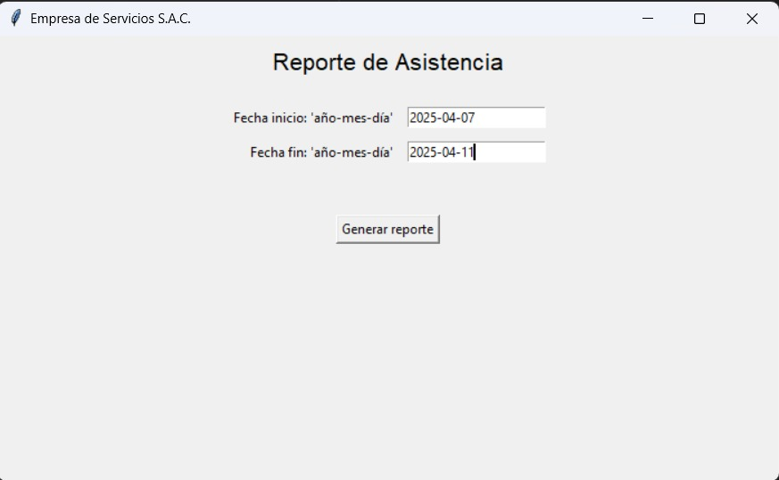
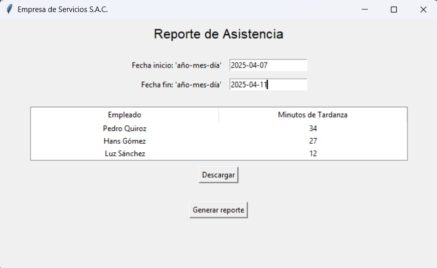
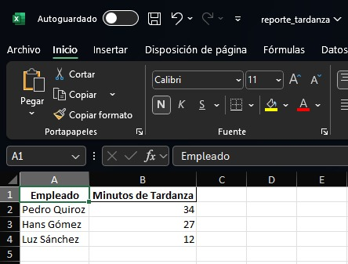

# 📋 Reporte de Asistencia

Este proyecto es una aplicación desarrollada en Python que permite gestionar y generar reportes de asistencia de manera eficiente. Utiliza un archivo JSON como base de datos para almacenar los registros de asistencia.

## 🚀 Características

- Registro de asistencias con detalles como nombre, fecha y hora.
- Generación de reportes en formato JSON.
- Interfaz sencilla y fácil de usar.
- Estructura modular para facilitar el mantenimiento y la escalabilidad.

## 🖼️ Capturas de Pantalla

### 🏠 Vista Inicial

### 📄 Reporte Generado

## 🖱️ Descarga

## 🛠️ Tecnologías Utilizadas

- Python 3
- JSON para almacenamiento de datos

